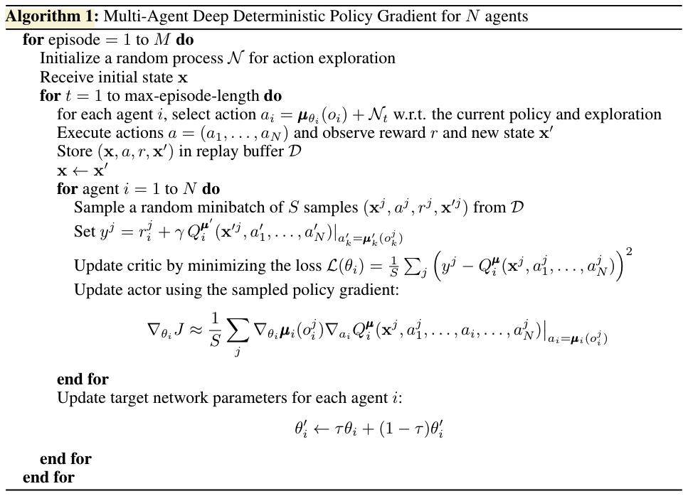

# Implementation of DDPG and PPO in MA

## The Algorithm (MADDPG)

### Pseudocode





### Parameters:
```

```


## Credits:

### MADDPG:

- [`simple_spread` environment](https://www.pettingzoo.ml/mpe/simple_spread)
- [RealPython | How to Use Generators and yield in Python](https://realpython.com/introduction-to-python-generators/)
- Other implementations: [variant 1](https://github.com/starry-sky6688/MADDPG/blob/master/maddpg/maddpg.py), [variant 2](https://github.com/xuehy/pytorch-maddpg/blob/master/MADDPG.py), [variant 3](https://github.com/shariqiqbal2810/maddpg-pytorch/blob/master/algorithms/maddpg.py)
- []()


